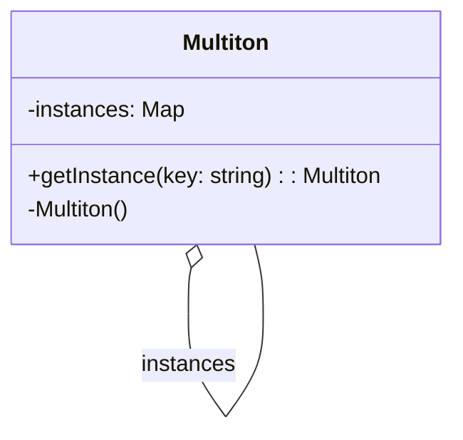
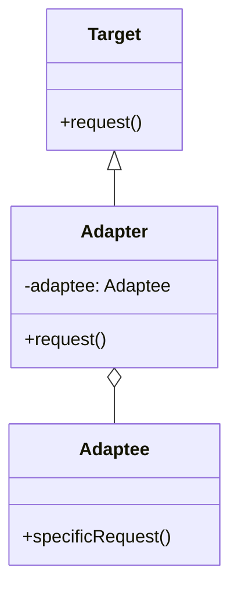
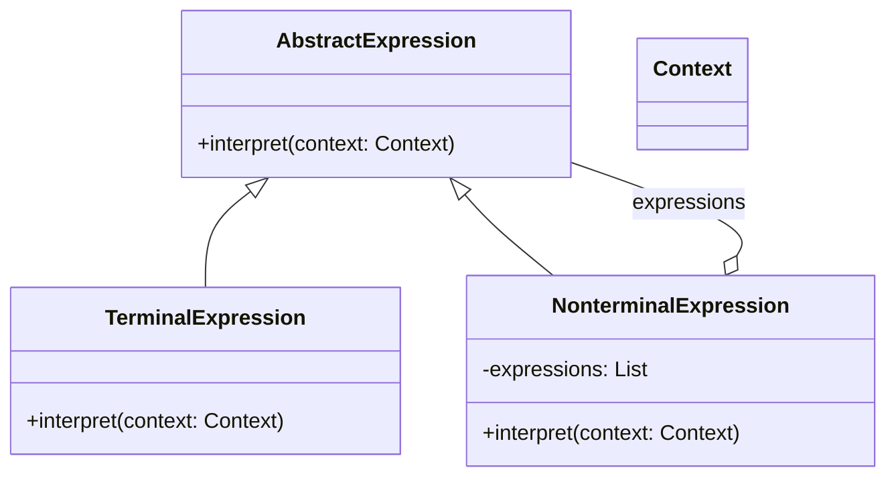
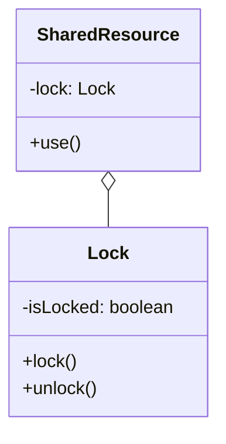

# АППЗ .Net Розрахунково-графічна робота №1.
### Тема: Шаблони проектування.

1. **Multiton (Creational Pattern)**
Multiton - це шаблон проектування, який узагальнює шаблон Singleton. Відмінність полягає в тому, що Singleton дозволяє створити лише один екземпляр класу, а Multiton дозволяє контрольовано створювати кілька екземплярів, які він керує за допомогою карти. Цей шаблон спрощує отримання спільних об’єктів в додатку.  

Основні складові:
- Ключ: Ідентифікатор, який використовується для отримання екземпляра Multiton.
- Екземпляр: Об’єкт, який створюється і зберігається в Multiton.
- Карта: Структура даних, яка використовується для зберігання екземплярів Multiton.

**Переваги:**
Дозволяє обмежити кількість екземплярів класу, дозволяючи при цьому створювати кілька екземплярів.
Забезпечує централізований доступ до одного каталогу multitons, де кожен екземпляр multiton в пулі може існувати, маючи свій власний стан.  

**Недоліки:**
Цей шаблон, як і шаблон Singleton, ускладнює модульне тестування, оскільки він вводить глобальний стан в додаток.
З garbage collected мовами він може стати джерелом витоку пам’яті, оскільки він вводить глобальні сильні посилання на об’єкти.  

**Приклади використання:**
Multiton - це шаблон проектування, який забезпечує лише один об’єкт, що буде створений для ключа в багатопоточному середовищі.  

2. **Adapter або Wrapper (Structural Pattern)**  
Adapter - це шаблон проектування, який дозволяє використовувати інтерфейс існуючого класу як інший інтерфейс. Це часто використовується для того, щоб зробити існуючі класи сумісними з іншими без зміни їх вихідного коду5. Цей шаблон дозволяє “перекладати” один інтерфейс на інший.  

Основні складові:
- Цільовий інтерфейс: Інтерфейс, який очікується клієнтським кодом.
- Adaptee: Існуючий клас або система з несумісним інтерфейсом, який потрібно інтегрувати в нову систему.
- Adapter: Клас, який реалізує цільовий інтерфейс і внутрішньо використовує екземпляр Adaptee, щоб зробити його сумісним з цільовим інтерфейсом.  

**Переваги:**
Дозволяє використовувати існуючі класи з іншими, не змінюючи їх вихідний код.
Адаптери дозволяють вам обмежити кількість екземплярів класу, при цьому дозволяючи створювати кілька екземплярів.  

**Недоліки:**
Введення адаптерів може додати додатковий шар складності до кодової бази.
Використання адаптерів надмірно може призвести до надмірно складної та заплутаної архітектури.  

**Приклади використання:**
Шаблон адаптера часто використовується в програмних мовах, де він використовується для аналізу та оцінки виразів.
Він також використовується в інших програмних додатках, яким потрібна оцінка складних виразів, таких як математичні або логічні вирази.

3. **Interpreter (Behavioral Pattern)**
Interpreter - це шаблон проектування, який визначає спосіб інтерпретації та оцінки мовних граматик або виразів. Він надає механізм для оцінки речень в мові, представляючи їх граматику як набір класів. Кожен клас представляє правило або вираз в граматиці, і шаблон дозволяє ці класи компонувати ієрархічно для інтерпретації складних виразів.  

Основні складові:
- Абстрактний вираз: Це абстрактний клас або інтерфейс, який оголошує абстрактний метод інтерпретації.
- Термінальний вираз: Це конкретні класи, які реалізують інтерфейс абстрактного виразу.
- Нетермінальний вираз: Це також конкретні класи, які реалізують інтерфейс абстрактного виразу.  

**Переваги:**
Легко змінювати та розширювати граматику.
Реалізація граматики є прямолінійною8.  

**Недоліки:**
Складні граматики важко підтримувати, оскільки буде багато термінальних класів.  

**Приклади використання:**
Шаблон Interpreter часто використовується в програмних мовах, де він використовується для аналізу та оцінки виразів.
Він також використовується в інших програмних додатках, яким потрібна оцінка складних виразів, таких як математичні або логічні вирази.  

4. **Lock (Concurrency Pattern)**
Lock - це шаблон паралельних обчислень, який використовується для контролю доступу до спільних ресурсів в базі даних. Цей протокол допомагає підтримувати послідовність даних та цілісність даних серед кількох користувачів.  

Основні складові частини Lock:
- Ключ: Ідентифікатор, який використовується для отримання доступу до ресурсу.
- Ресурс: Об’єкт, до якого потрібно отримати доступ.
- Блокування: Механізм, який використовується для контролю доступу до ресурсу.  

**Переваги:**
Легко змінювати та розширювати граматику.
Реалізація граматики є прямолінійною.  

**Недоліки:**
Якщо конкуренція даних висока, повторні транзакції можуть призвести до голодування і значно вплинути на продуктивність.  

**Приклади використання:**
Для надання контролю за конкуренцією та запобігання неконтрольованому доступу до даних, менеджер бази даних ставить блокування на буферні пули.

## Таблиця посилань на першоджерела

| Дизайн паттерн | Посилання |
|----------------|-----------|
| Мультитон      | [Medium](https://justgokus.medium.com/what-is-the-multiton-design-pattern-eeeb5dd8bc7d), [Wikipedia](https://en.wikipedia.org/wiki/Multiton_pattern), [Stack Overflow](https://stackoverflow.com/questions/9631087/multiton-real-world-example), [Code Chuckle](https://medium.com/@codechuckle/demystifying-design-patterns-multiton-pattern-859b50638a9f), [Code Project](https://www.codeproject.com/Articles/1178694/Singleton-and-Multiton-Pattern) |
| Адаптер        | [DZone](https://dzone.com/articles/adapter-design-pattern-in-java), [Pentalog](https://www.pentalog.com/blog/design-patterns/adapter-design-pattern/), [Stackify](https://stackify.com/design-patterns-explained-adapter-pattern-with-code-examples/), [GeeksforGeeks](https://www.geeksforgeeks.org/adapter-pattern/), [OODesign](https://www.oodesign.com/adapter-pattern), [The Coded Self](https://www.thecodedself.com/The-Difference-Between-an-Adapter-and-a-Wrapper/), [Stack Interface](https://stackinterface.com/adapter-design-pattern/), [FreeCodeCamp](https://www.freecodecamp.org/news/design-pattern-for-modern-backend-development-and-use-cases/) |
| Інтерпретатор  | [Visual Paradigm](https://tutorials.visual-paradigm.com/interpreter-pattern-tutorial/), [Simple Tech Talks](https://simpletechtalks.com/interpreter-design-pattern-explained-with-simple-example/), [GeeksforGeeks](https://www.geeksforgeeks.org/interpreter-design-pattern/), [Dot Net Tutorials](https://dotnettutorials.net/lesson/interpreter-design-pattern/), [InfoWorld](https://www.infoworld.com/article/3243279/how-to-work-with-the-interpreter-design-pattern.html), [TutorialsPoint](https://www.tutorialspoint.com/design_pattern/interpreter_pattern.htm) |
| Багаторівневе блокування | [Educative](https://www.educative.io/courses/deep-dive-into-the-internals-of-the-database/optimistic-vs-pessimistic-concurrency-control), [IBM](https://www.ibm.com/docs/en/db2/10.5?topic=management-locks-concurrency-control), [OSTEP](https://pages.cs.wisc.edu/~remzi/OSTEP/threads-locks-usage.pdf), [GeeksforGeeks](https://www.geeksforgeeks.org/two-phase-locking-protocol/), [Wikipedia](https://en.wikipedia.org/wiki/Lock_%28computer_science%29) |
| Модифікація розблокування | [Hacking with Rust](https://www.hackingwithrust.net/2024/01/22/simplifying-concurrency-easy-implementation-of-double-checked-locking-pattern-in-rust/), [Oracle Blogs](https://blogs.oracle.com/maa/post/from-chaos-to-order-the-importance-of-concurrency-control-within-the-database-2-of-6) |

## Посилання на джерела інформації
https://justgokus.medium.com/what-is-the-multiton-design-pattern-eeeb5dd8bc7d  

https://en.wikipedia.org/wiki/Multiton_pattern  

https://stackoverflow.com/questions/9631087/multiton-real-world-example  

https://dzone.com/articles/adapter-design-pattern-in-java  

https://www.pentalog.com/blog/design-patterns/adapter-design-pattern/  

https://stackify.com/design-patterns-explained-adapter-pattern-with-code-examples/  

https://tutorials.visual-paradigm.com/interpreter-pattern-tutorial/  

https://simpletechtalks.com/interpreter-design-pattern-explained-with-simple-example/  

https://www.geeksforgeeks.org/interpreter-design-pattern/  

https://www.baeldung.com/java-concurrent-locks  

https://www.educative.io/courses/deep-dive-into-the-internals-of-the-database/optimistic-vs-pessimistic-concurrency-control  

https://www.ibm.com/docs/en/db2/10.5?topic=management-locks-concurrency-control  

https://pages.cs.wisc.edu/~remzi/OSTEP/threads-locks-usage.pdf  

https://medium.com/@codechuckle/demystifying-design-patterns-multiton-pattern-859b50638a9f  

https://www.codeproject.com/Articles/1178694/Singleton-and-Multiton-Pattern  

https://www.geeksforgeeks.org/adapter-pattern/  

https://www.oodesign.com/adapter-pattern  

https://www.thecodedself.com/The-Difference-Between-an-Adapter-and-a-Wrapper/  

https://stackinterface.com/adapter-design-pattern/  

https://www.freecodecamp.org/news/design-pattern-for-modern-backend-development-and-use-cases/  

https://dotnettutorials.net/lesson/interpreter-design-pattern/  

https://www.infoworld.com/article/3243279/how-to-work-with-the-interpreter-design-pattern.html  

https://www.tutorialspoint.com/design_pattern/interpreter_pattern.htm  

https://www.geeksforgeeks.org/two-phase-locking-protocol/  

https://en.wikipedia.org/wiki/Lock_%28computer_science%29  

https://www.hackingwithrust.net/2024/01/22/simplifying-concurrency-easy-implementation-of-double-checked-locking-pattern-in-rust/  

https://blogs.oracle.com/maa/post/from-chaos-to-order-the-importance-of-concurrency-control-within-the-database-2-of-6  

